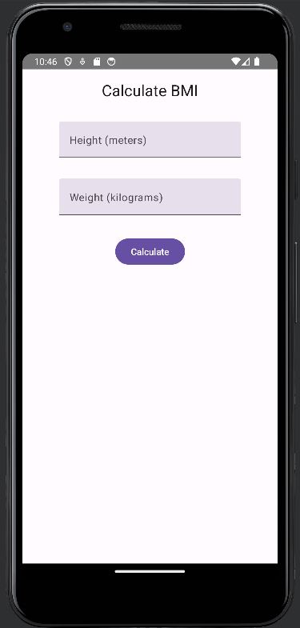
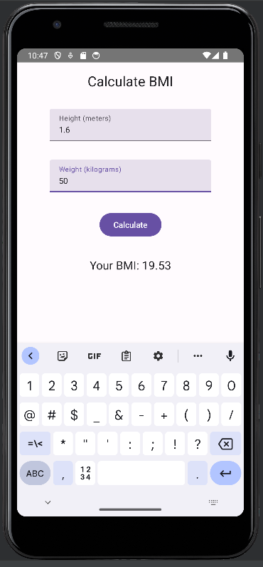

## Body Mass Index Calculator using ViewModel

### Description
This Android application, developed using Kotlin and Jetpack Compose, calculates the Body Mass Index (BMI) based on a person's height and weight. The formula used for calculating BMI is weight / (height * height). The app utilizes a ViewModel class to manage all necessary information and operations.

### Features
- Calculates BMI based on user-provided height and weight.
- Utilizes ViewModel architecture for managing data and operations.
- Provides a clean and simple user interface.

### Instructions
1. Ensure that the required libraries are added to the `build.gradle` file and synced properly.
2. Create a separate class file for the ViewModel to hold member variables and methods.
3. Add member variables for height, weight, and BMI calculation result.
4. Implement methods for updating member variables when user input changes.
5. Include a private method for BMI calculation, converting input into numbers and calculating the result.
6. Call the private calculation method when returning the value for BMI.

### UI
The user interface for the application should include:
- Input fields for entering height (in meters) and weight (in kilograms).
- A button to trigger the BMI calculation.
- Display area to show the calculated BMI result.

### Additional Notes
- You may refer to previous exercises or implementations to create the UI.
- Make sure to follow best practices in code organization and architecture.
- Test the application thoroughly to ensure accurate BMI calculation and proper functionality.

### Author
Jouni Juntunen

### Date
Spring 2023

### Course
ANDROID 1(1) - Information Technology
Oulu University of Applied Sciences
